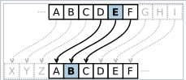

#  Java project that includes two encryption methods: Caesar and Double cube (Doppelwürfel).

****

**This project consists of two encryption methods: the Caesar Cipher and the double cube encryption.**

# Caesar Cipher

**A Caesar cipher is a straightforward way of message encoding. To generate an encoding alphabet, Caesar ciphers employ a substitution mechanism in which letters in the alphabet are displaced by a specified number of spaces. with a left shift of 3, D would be replaced by A, E would become B, and so on. The approach was called after Julius Caesar, the Roman commander who employed it in his private communication.**

****

Here is an example of how the Caesar Cipher operates.

**Since the Caesar Cipher only accepts one key, the key in this case is books. In this scenario, the Caesar cipher would encode N as S, e as j, and so on. For further information, see the table below. "Never judge a book by its film" was written into the text box. After that, the text is encrypted, giving the Cipher-text " Sjajw ozilj f gttp gd nyx rtanj."**

| a | b | c | d | e | f | g | h | i | j | k | l | m | n | o | p | q | r | s | t | u | v | w | x | y | z |
|---|---|---|---|---|---|---|---|---|---|---|---|---|---|---|---|---|---|---|---|---|---|---|---|---|---|
| f | g | h | i | j | k | l | m | n | o | p | q | r | s | t | u | v | w | x | y | z | a | b | c | d | e |
****
The message can afterwards be decrypted.

****

# Double cube encryption

**An important application of encryption technology in the 19th and early 20th century was the so-called double cube (Übchi); a method with a double column transposition. This procedure is feasible by hand and to date no ciphertext-only attack has become known.**
****

Here is an example of how the Double cube encryption works.

**An example will now be used to show how the encryption works. First, we'll need a plaintext to encrypt. At this point, the plaintext is: I need back up now.
Similarly, two keys are required. NOTEBOOK, with a length of 8, is used as the initial key. The plaintext is now input one line at a time into a rectangle whose width is dictated by the length of the key used. The length of the text used determines the height of the cube.**

| N | O | T | E | B | O | O | K |
|---|---|---|---|---|---|---|---|
| 4 | 5 | 8 | 2 | 1 | 6 | 7 | 3 |
| i | n | e | e | d | b | a | c |
| k | u | p | n | o | w |   |   |

As a result, the output will look like this.

**output: doenciknubwaep** ==>
B1 = do 
E2 = en
K3 = c 
and so on.

The second key word is MUSIC.

| M | U | S | I | C |
|---|---|---|---|---|
| 3 | 5 | 4 | 2 | 1 |
| d | o | e | n | c |
| i | k | n | u | b |
| w | a | e | p |   |

**output: cbnupdiweneoka**

****

Shift the first and second keys to decipher the text.

